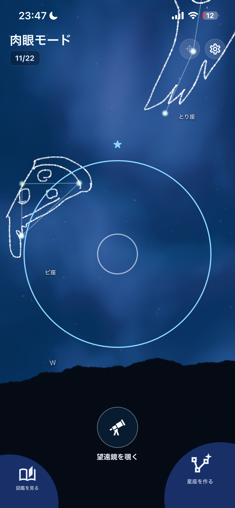
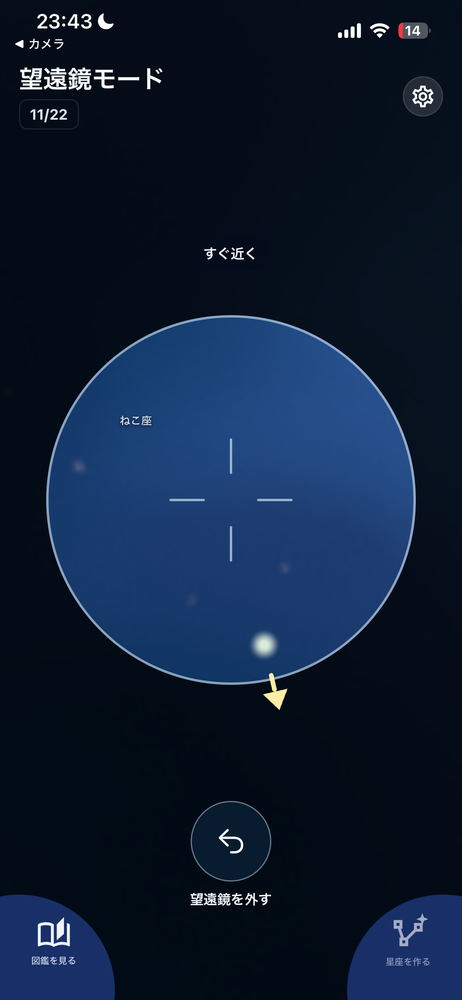
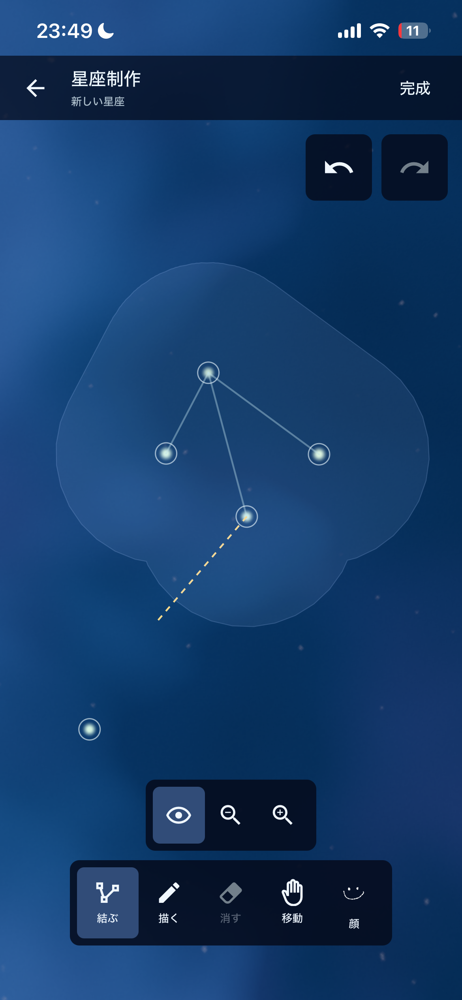
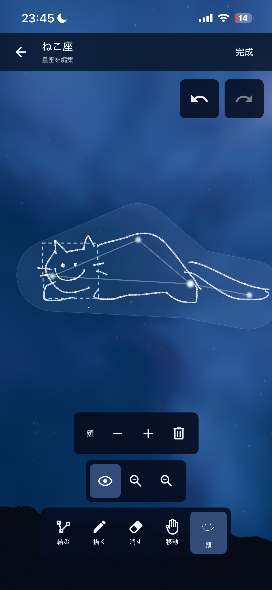
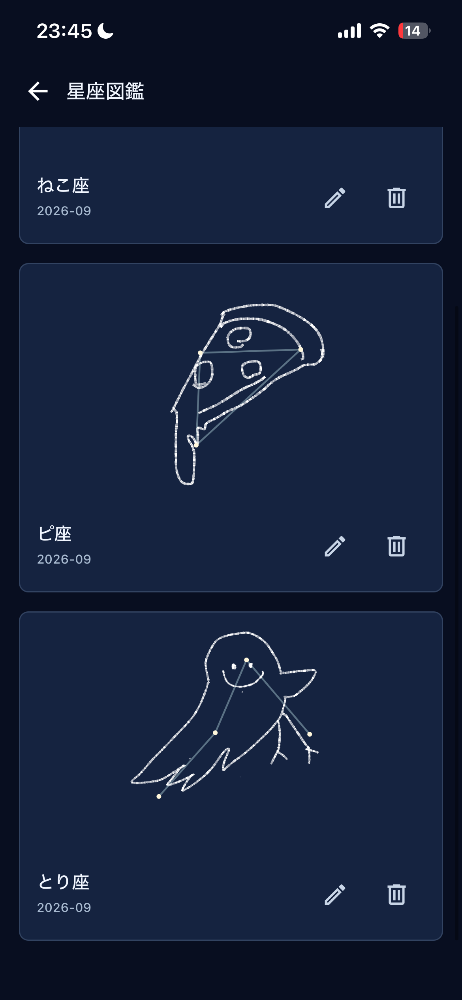

# デモ動画

<https://github.com/user-attachments/assets/b13e5e39-2b7a-4555-acf0-a1873cfcc6ad>

# seiza

**seiza** は、夜空を見渡して星を探し、自分だけの星座を作る探索ゲームです。Expo / React Native で開発中です。

都会でも、雨の日でも、部屋の中でも天体観測！
<p align="center">
  
</p>
スマホを掲げて夜空を見渡し、望遠鏡を覗いて隠れた星を探す星空探索ゲームです。
<p align="center">
  
</p>
見つけた星を自由につなぎ、手描きのイラストや顔を加えて、自分だけの星座を作ることができます！
<p align="center">
  
</p>
同じ星の並びでも、何に見えるかはあなた次第。動物に見立てたり、不思議な生き物を描いたり、思い思いの形に仕上げてみましょう！
<p align="center">
  
</p>
完成した星座には好きな名前を付けて、自分だけの星座図鑑に残すことができます。
<p align="center">
  
</p>
## 開発・起動

```bash
npm install
npx expo start
```

表示された案内から iPhone の Expo Go、シミュレーター、または Web で開けます。ジャイロ操作やタッチ操作の確認には実機を推奨します。

```bash
npx tsc --noEmit
npx expo lint
npm run test:domain
npm run test:constellation
npm run test:artwork
```

現在は端末内へのローカル保存を使用します。Supabase・認証・クラウド同期は未実装です。詳しい仕様は [`docs/game-design.md`](docs/game-design.md) と [`docs/architecture.md`](docs/architecture.md) を参照してください。
